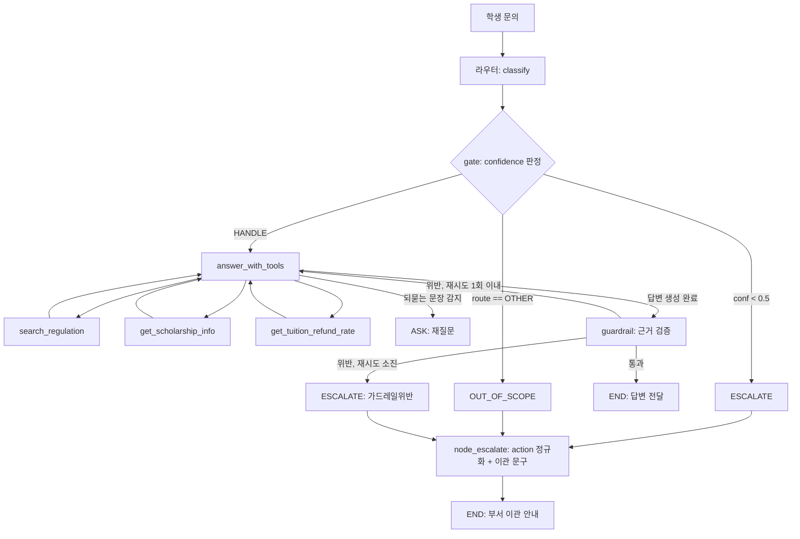
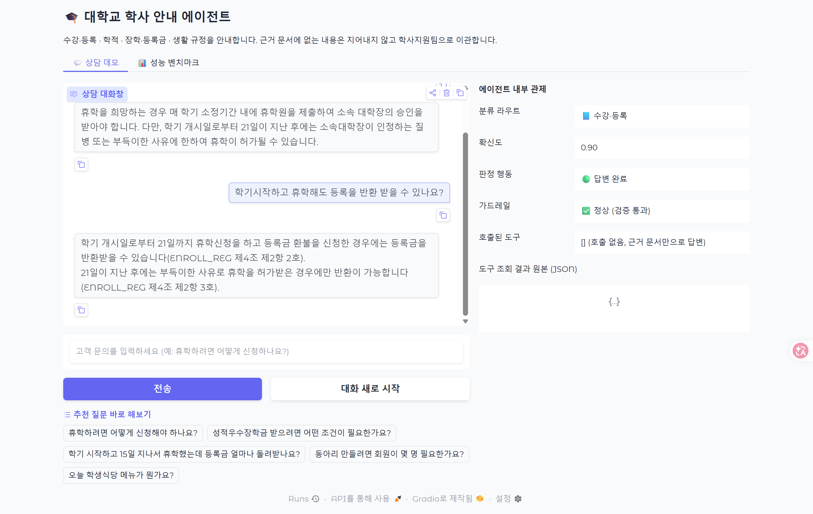
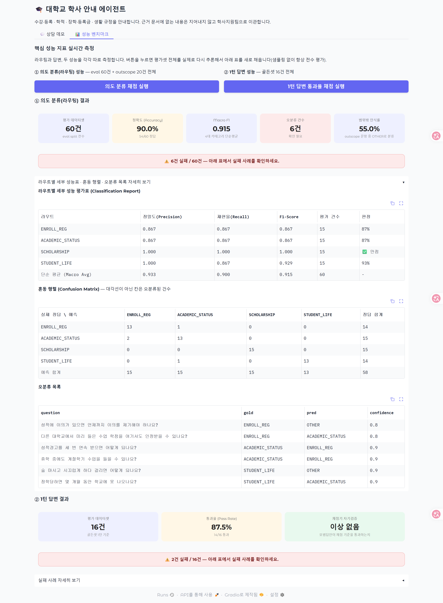

# 대학교 학사 안내 고객응대 에이전트 — 프로젝트 보고서

AIFFEL "에이전트 팀 꾸리기" 과정 노드5(고객응대 에이전트 만들기 [프로젝트]) 제출 보고서입니다. 노드4 실습(가상 쇼핑몰 "모두몰" 고객응대 에이전트)과 동일한 라우팅 → 그라운딩 → 가드레일 구조를 대학 학사 안내 도메인에 적용했습니다.

---

## 1. 주제와 근거문서

### 1.1 주제

대학교 학사 규정 안내 고객응대 에이전트입니다. 학생이 자연어로 학사 관련 문의를 하면, 문의를 4개 카테고리 중 하나로 분류하고 해당 카테고리 근거 규정만으로 답하며, 근거에 없는 내용은 지어내지 않고 담당 부서로 이관합니다.

### 1.2 근거문서

실제 대학교 규정 원문(2026년 시행본)을 `guide_docs/`에 마크다운으로 전문 변환해 그라운딩 정본으로 사용합니다.

| 문서 | 범위 |
| --- | --- |
| `KHU_학칙.md` | 학칙 전문(제1조~제109조, 부칙 포함) |
| `KHU_학사운영에_관한_규정.md` | 학사운영에 관한 규정 전문(제1조~제50조) |
| `KHU_장학규정.md` | 장학규정 전문(제1조~제16조) |
| `KHU_교내장학금_종류_및_지급기준.md` | 별표1 — 장학금 32종 지급기준 표 |
| `KHU_학생생활규정.md` | 학생생활규정 전문(제1조~제20조) |
| `KHU_학생상벌에관한규정.md` | 학생상벌에관한규정 전문(제1조~제21조) — 표창·징계의 절차(위원회·시효·심의·효력·청원) |

원본 PDF는 텍스트 레이어가 없는 벡터 렌더링 문서라 `pypdf`/`pymupdf`로 직접 추출이 되지 않았으며, 위 마크다운 변환본을 근거 원문으로 채택했습니다. 생활관규정은 원문 확보가 되지 않아 이번 범위에서 계속 제외했습니다 — 관련 문의는 OTHER로 분류해 담당 부서로 이관합니다.

`data/policy_academic.md`는 정본이 아니라, "어느 카테고리가 어느 조문을 근거로 하는지"를 정리한 인덱스 문서입니다. 실제 프롬프트에 주입되는 근거는 항상 `guide_docs/*.md` 원문에서 `context.py`가 직접 조립합니다(요약본을 근거로 쓰면 조문 누락 위험이 있고, 가드레일이 원문을 대조해야 의미가 있기 때문입니다).

구조화가 필요한 두 가지는 별도 JSON으로 관리합니다.

- `data/scholarship_table.json` — 별표1 장학금 32종(이름/기준/금액), 원문과 전량 대조 검증
- `data/tuition_refund_table.json` — 학사운영규정 제4조 등록금 반환 비율표(5개 구간), 원문과 대조 검증

---

## 2. 카테고리 설계

5개 라우트: `ENROLL_REG`(수강·등록) · `ACADEMIC_STATUS`(학적) · `SCHOLARSHIP`(장학·등록금) · `STUDENT_LIFE`(생활) · `OTHER`(범위밖). 4-카테고리 성능 지표(macro F1 등)는 `OTHER`를 제외하고 계산합니다.

| 카테고리 | 근거 | 경계 설계 결정 |
| --- | --- | --- |
| ENROLL_REG | 학사운영규정 제2·3·6·7·8·9·11장, 학칙 제10장 | "교육과정"(개편·교과목 분류)은 여기로 분류 |
| ACADEMIC_STATUS | 학칙 제8·9장, 학사운영규정 제4·5장 | "전공"(배정·이수·다전공·부전공)은 여기로 분류(전과와는 별개 절로 구분) |
| SCHOLARSHIP | 장학규정 전문, 별표1 | 등록금 반환은 ENROLL_REG와 근거(학사운영규정 제4조)를 공유 |
| STUDENT_LIFE | 학생생활규정 전문, 학생상벌에관한규정 전문 | 생활관규정만 문서 미확보로 제외 |
| OTHER | 위 4개 어디에도 해당 없음 | 개인 기록 조회, 타 대학 비교, 법률·진로·심리 상담, 생활관 문의, 잡담, 맥락 의존 질문 |

가장 까다로웠던 경계 결정 두 가지입니다.

1. **"전공" vs "교육과정"**: "전공배정 어떻게 받나요"는 ACADEMIC_STATUS, "교육과정이 왜 바뀌었나요"는 ENROLL_REG — 둘 다 표면적으로는 "커리큘럼" 계열 단어지만 학생이 실제로 알고 싶은 것(내 학적 상태 vs 교육과정 자체의 구성)을 기준으로 나눴습니다.
2. **키워드는 있으나 문서가 없는 주제(생활관)**: "기숙사비 얼마인가요"는 STUDENT_LIFE 키워드(생활)와 맞닿아 있지만, 생활관규정 자체를 근거 문서로 확보하지 못했으므로 OTHER로 분류해야 합니다. 이 경계가 실제로 가장 많이 깨졌습니다(§4.3 실패 분석 참조).

---

## 3. 평가셋 설계

| 파일 | 규모 | 용도 |
| --- | --- | --- |
| `student_inquiries.csv` + `routing_answers.csv` | 100건 (4개 카테고리 × eval 15 + fewshot 5 = 80건, OTHER outscope 20건) | 라우팅 정확도·macro F1·범위밖 인식률 측정 |
| `hard_cases.csv` | 30건 (경계모호·다중의도·분류체계밖·극단단답·문맥의존·텍스트손상 각 5건) | 라우팅 경계 사례 정성 점검 |
| `answer_goldenset_multiturn.json` | 16개 대화(4개 카테고리 균등 분포) | 1턴 답변 통과율 채점(action/tools/must/forbid 4축) |

설계 원칙은 다음과 같습니다.

- **eval/fewshot 분리**: fewshot 문항(각 카테고리 5건)은 라우터 프롬프트에 예시로 주입하고, eval 문항(각 15건)은 채점에만 쓰며 프롬프트에는 절대 넣지 않습니다.
- **OTHER는 outscope로 별도 분리**: OTHER 20건은 `split=outscope`로 분리해 4-카테고리 macro F1에서 제외하되, "outscope 문항 중 실제로 OTHER로 분류된 비율"을 별도 지표(범위밖 인식률)로 추가했습니다. 이는 노드4 실습(모두몰) `evaluate.py`에는 없던 지표로, "넘기기 경로도 재야 한다"는 과제 요구사항을 채우기 위해 자체적으로 추가한 것입니다.
- **난이도 혼합**: 쉬운 문항(조문 하나로 답 가능)·보통 문항(여러 조문을 같이 봐야 함)·함정 문항(그럴듯하지만 문서에 없어 반드시 이관해야 정답)을 각 카테고리에 고르게 섞었습니다.
- **채점기 자기검증**: `evaluate.py`의 골든셋 채점 로직은 모범 답안 16건 전체가 스스로의 채점 기준(`must`/`forbid`)을 통과하는지 먼저 검증합니다. 이 자기검증이 실제로 저작 버그(정답 문장 "불가능합니다"가 forbid 문구 "가능합니다"의 부분문자열과 충돌)를 잡아냈습니다.

---

## 4. 측정 결과

### 4.1 최종 수치 (전수 평가, 샘플링 없음)

| 지표 | 값 |
| --- | --- |
| 라우팅 정확도 (eval 60건) | 0.87~0.90 |
| 라우팅 macro F1 (4개 카테고리) | 0.90~0.92 |
| 범위밖 인식률 (outscope 20건) | 0.550 |
| 1턴 답변 통과율 (골든셋 16건) | 100% (16/16) |

라우팅 정확도·macro F1은 `evaluate.py`를 반복 실행할 때마다 소수점 둘째 자리 수준으로 변동합니다(`temperature=0`으로 호출하지만 동일 입력에도 매 호출이 완전히 동일한 결과를 보장하지는 않는 것으로 관찰됨). 범위밖 인식률과 답변 통과율은 여러 차례 재실행해도 각각 0.550, 100%로 고정적으로 재현되었습니다.
| 채점기 자기검증 | 이상 없음 |

### 4.2 개선 기록 (요약)

| 회차 | 변경 대상 | 변경 이유 | 결과 |
| --- | --- | --- | --- |
| 0 (기준선) | — | fewshot 예시를 실제로 프롬프트에 주입하지 않던 버그 수정 | 정확도 0.850 · macro F1 0.885 · 범위밖 인식률 0.600 |
| 1 | `prompts.py` ROUTE_GUIDE | 범위밖 인식률(0.6)이 낮아 OTHER 예시 5개 추가 | 범위밖 0.6→0.9로 개선되었으나 정확도 0.85→0.75로 하락(트레이드오프) → 원복 |
| 2 | `prompts.py` ROUTE_GUIDE | 경계 해소 시 confidence를 0.8 이상으로 올리도록 지시 추가(멀티턴 라우팅 신뢰도 안정화 목적) | 정확도·macro F1은 개선(0.883/0.906)되었으나 범위밖 인식률이 재하락(0.550) — §4.3 참조 |

### 4.3 실패 분석 — 범위밖 인식률 하락(0.6 → 0.55)

**증상**: outscope 20건 중 9건이 실제 카테고리로 오분류되며, 전부 `confidence=0.90, action=HANDLE`로 확인되었습니다. 즉 단순 지표 착시가 아니라 에이전트가 실제로 잘못된 근거로 답변을 시도하는 오류입니다.

**오분류 사례** (표면 키워드 → 잘못 배정된 카테고리):

| 질문 | 잘못 배정된 카테고리 | 실제 정답 사유 |
| --- | --- | --- |
| 기숙사비는 한 학기에 얼마인가요? | STUDENT_LIFE | 생활관규정 미보유 문서 |
| 생활관(기숙사) 배정 기준이 어떻게 되나요? | STUDENT_LIFE | 생활관규정 미보유 문서 |
| 제가 지금 장학금 받을 자격이 되는지 계산해서 알려주실 수 있나요? | SCHOLARSHIP | 개인 성적 조회 필요(에이전트가 접근 불가) |
| 장학금 신청서 양식 파일을 다운로드할 수 있게 보내주실 수 있나요? | SCHOLARSHIP | 파일 발급 요청(안내 범위 밖) |
| 다음 학기 등록금이 오르나요, 내리나요? | ENROLL_REG | 미래 예측(규정에 없는 정보) |
| 다른 학교 편입 학점인정 기준도 알려줄 수 있나요? | ACADEMIC_STATUS | 타 대학 규정(우리 근거 문서 밖) |
| 자퇴하면 나중에 법적으로 문제가 생기나요? | ACADEMIC_STATUS | 법률 자문 요청 |
| 이번에 등록 안 하면 저 제적되나요? 제 학번으로 확인해주실 수 있나요? | ACADEMIC_STATUS | 개인 학적 조회 필요 |

**원인**: 회차 2에서 추가한 라우팅 판단 원칙("여러 카테고리 키워드가 섞여도 규칙으로 이미 정리됐다면 confidence를 낮추지 말고 0.8 이상으로 답하라")은 원래 "휴학하면 등록금은 어떻게 되나요"처럼 정상적인 카테고리 중의성을 해소하기 위한 규칙이었습니다. 그런데 이 규칙이 OTHER 트랩 문항에도 그대로 적용되어, "기숙사/장학금/등록금/편입/자퇴/제적" 같은 표면 키워드가 하나라도 잡히면 모델이 고확신으로 해당 카테고리에 배정해버리는 부작용이 발생했습니다. `ROUTE_GUIDE`의 OTHER 카테고리 정의에는 개인 기록 조회·타 대학 비교·법률 상담·생활관 문의 같은 트랩 유형이 이미 명시돼 있지만, "판단 원칙"에는 이 트랩 패턴을 먼저 걸러내라는 우선순위 규칙이 없어, confidence 상승 규칙이 트랩 탐지보다 먼저 적용된 것이 근본 원인입니다.

**교훈**: 라우팅 confidence 튜닝처럼 "국소적으로는 옳은" 프롬프트 수정도, 카테고리 경계 전체에 걸쳐 회귀 테스트(특히 outscope 세트)를 다시 돌리지 않으면 다른 지표를 조용히 깎아 먹을 수 있습니다. 이번 프로젝트에서 "한 번에 하나만 바꾸고 두 지표를 함께 재측정한다"는 원칙을 실험 기록에 명시한 이유이기도 합니다. 이후 조치로는, 판단 원칙에 "OTHER 트랩 패턴(개인정보 조회·타 대학 비교·미래 예측·서류 발급 요청·법률 자문·미보유 문서 주제)이 먼저 감지되면 confidence 상승 규칙보다 우선한다"는 순서 규칙을 추가하는 방향을 다음 개선 과제로 남겨둡니다.

### 4.4 가드레일 한계

가드레일은 답변 속 숫자를 정규식으로 추출해 근거(도구 결과 + 카테고리 컨텍스트) 안에 문자열로 존재하는지 확인하는 방식입니다. 짧은 숫자(예: "5", "10")는 문서 전체에 우연히 등장할 수 있어 오탐을 놓치는 한계가 있습니다. 반대로, 도구가 준 숫자를 다른 표현으로 재계산(예: "5/6"을 "83.33%"로 환산)하면 정당한 답변도 근거 불일치로 걸러지는 과탐 사례가 있었고, 이는 "도구가 준 숫자·비율을 그대로 쓰라"는 프롬프트 규칙 추가로 해결했습니다.

### 4.5 병렬 처리 검증

`common.py`의 `pmap()`(ThreadPoolExecutor 기반)이 실제로 병렬화되는지 별도로 측정했습니다. 동일한 LLM 호출 8건을 `workers=1`(직렬)과 `workers=8`(병렬)로 각각 실행한 결과, 13.71초 → 1.23초로 약 11배 단축을 확인했습니다. `evaluate.py`의 3개 `pmap()` 호출 지점이 `config.WORKERS`를 실제로 전달하지 않고 있던 배선 누락도 이번에 함께 수정했습니다.

---

## 5. 파이프라인 구조도

- **라우팅**: `gpt-4.1-nano` + `with_structured_output`, fewshot 25건 프롬프트 주입, `CONF_THRESHOLD=0.5`.
- **그라운딩**: 카테고리별 조문 원문(`context.build_context`)을 프롬프트에 직접 주입 + 3개 조회 도구(`gpt-4.1-mini`, `MAX_TOOL_TURNS=3`).
- **가드레일**: 답변 속 숫자를 도구 결과 + 카테고리 컨텍스트 전체와 대조, 위반 시 `GUARDRAIL_RETRY=1`회 재시도 후 이관.
- **멀티턴**: `InMemorySaver` 체크포인터로 `thread_id`별 대화 상태를 유지하되, 각 턴의 라우팅·답변 생성은 직전 턴의 질문을 이어붙이지 않고 현재 질문만으로 독립 판단합니다(최초에는 이전 턴을 이어붙이는 방식이었으나, 완전히 무관한 새 질문에도 이전 주제가 섞여 답이 오염되는 실제 버그가 발견되어 되돌렸습니다 — §7 참조).

---

## 6. 데모 설계

Gradio 3-tab(현재는 2-tab 노출) 구성으로 `python app.py` 실행 후 `http://127.0.0.1:7861`에서 접속합니다.

### 6.1 💬 상담 데모

- 질문을 입력하면 채팅 말풍선 형태로 즉시 표시되고(`user_submit`), 이어서 답변이 채워집니다(`bot_respond`) — 두 단계로 나눠 "질문만 먼저 올라가고 답은 나중에" 붙는 자연스러운 UX를 구현했습니다.
- 우측 "에이전트 내부 관제" 패널에서 분류 라우트·확신도·판정 행동(처리/재질문/부서 이관)·가드레일 통과 여부·호출된 도구·도구 조회 결과 원본(JSON)을 실시간으로 확인할 수 있습니다.
- `InMemorySaver` + `thread_id`로 세션 내 멀티턴 대화를 지원합니다.

### 6.2 📊 성능 벤치마크

- 라우팅 성능(정확도·macro F1·범위밖 인식률·혼동행렬·오분류 목록)과 1턴 답변 성능(통과율·실패 사례)을 각각 버튼으로 재측정합니다.
- 샘플 수 옵션 없이 항상 평가셋 전체(eval 60건 + outscope 20건, 골든셋 16건)를 전수 평가하도록 고정했습니다.

### 6.3 📈 개선 기록 (현재 비공개)

무엇을 왜 바꿨고 수치가 어떻게 변했는지 회차별로 `experiment_log.csv`에 남기는 탭입니다. 제출 시점 UI에서는 숨김 처리했으나(`gr.Tab(..., visible=False)`) 코드와 로그 파일은 그대로 보존되어 있으며, §4.2의 개선 기록 표는 이 로그를 근거로 작성했습니다.

### 6.4 스크린샷

---

## 7. 프로젝트 회고

- **단계별 검증의 가치**: 처음부터 "다 만들고 나서 검증"이 아니라 각 Task(라우터 → 그라운딩 → 가드레일 → 그래프 통합 → 채점 → 데모)마다 터미널에서 직접 실행 결과를 확인하고 넘어간 덕분에, 버그가 어느 레이어에서 생겼는지 항상 명확했습니다. fewshot 미주입 버그, `.env` 미로딩 버그, `pmap`/`WORKERS` 배선 누락 등은 이 방식이 아니었다면 훨씬 늦게 발견됐을 것입니다.
- **라이브 데모 테스트가 가장 심각한 버그를 잡았다**: 자동 채점(`evaluate.py`)은 항상 1턴 단위로만 평가하기 때문에, 멀티턴 히스토리 오염 버그("장학금 질문 뒤에 완전히 무관한 질문을 하면 이전 주제가 섞여 나오는" 문제)는 실제로 Gradio 데모에서 연속 질문을 해보고 나서야 발견했습니다. 정량 지표와 정성적 라이브 테스트는 서로 다른 종류의 결함을 잡아낸다는 것을 확인했습니다.
- **프롬프트 수정의 트레이드오프**: 회차 1(OTHER 예시 추가)과 회차 2(confidence 상향 지시) 모두, 목표한 지표는 개선했지만 다른 지표를 조용히 깎아 먹었습니다. "한 번에 하나만 바꾸고 두 지표를 함께 재보는" 습관이 없었다면 이 트레이드오프를 놓쳤을 것입니다.
- **가드레일의 이중성**: 숫자 그라운딩 검증은 "지어낸 숫자"는 잘 잡지만, "정당한 재표현"(분수→퍼센트)까지 과탐하는 부작용이 있었습니다. 가드레일 설계는 "얼마나 엄격하게 잡을 것인가"와 "정상 답변을 얼마나 통과시킬 것인가" 사이의 균형 문제라는 것을 실감했습니다.
- **남은 과제**: §4.3에서 확인한 OTHER 트랩 탐지 우선순위 규칙 추가, 그리고 생활관 규정 문서 확보 시 STUDENT_LIFE 범위 재확장이 다음 개선 과제입니다.
